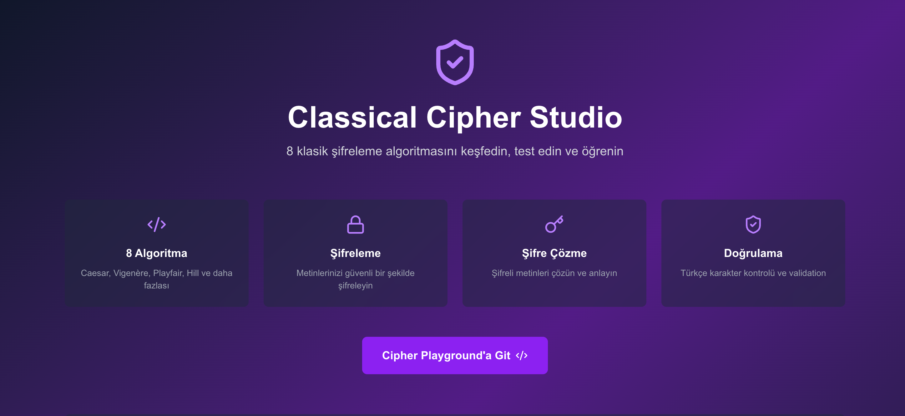
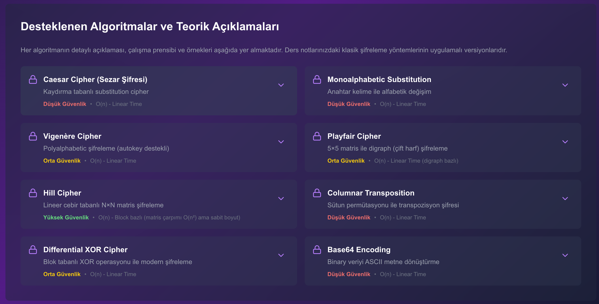

# 🔐 Network Security - Classical Cipher Suite

<div align="center">


**Dual implementation of 8 classical encryption algorithms in C# and TypeScript**  
*Educational, full-stack, cross-platform, comprehensive learning platform with step-by-step visualization*

[🌐 Live Demo](#) | [📖 Documentation](#-documentation) | [🚀 Quick Start](#-quick-start) | [🧪 Test Results](./TEST_RESULTS.md)

</div>

---

## 📸 Screenshots

<div align="center">

### Homepage - Feature Cards
*Modern UI showcasing 8 algorithms and feature highlights*



### Supported Algorithms - Detailed Explanations
*Expandable cards with history, theory, examples, and security analysis*



</div>

---

## 🎯 Project Overview

This project presents classical cryptography algorithms with a **dual-implementation** architecture:

- 🖥️ **C# .NET Console Application**: CLI tool with 21 unit tests and interactive menu
- 🌐 **Next.js Web Application**: Modern UI with real-time encryption/decryption and step-by-step visualization
- 🔄 **Cross-Platform**: Both implementations produce identical results
- 📚 **Educational**: Detailed theoretical explanations and examples for each algorithm
- ✅ **Test Driven**: 100% test coverage (21/21 passing tests on C# side)
- 🎬 **Step-by-Step Visualization**: Interactive playback showing exactly how each character transforms

---

## 🏗️ Project Structure

```
network_security/
├── ClassicalCipherSuite/          # C# .NET Console Application
│   ├── src/
│   │   ├── Ciphers/               # 8 cipher implementations
│   │   │   ├── CaesarCipher.cs
│   │   │   ├── MonoalphabeticCipher.cs
│   │   │   ├── VigenereCipher.cs
│   │   │   ├── PlayfairCipher.cs
│   │   │   ├── HillCipherNxN.cs
│   │   │   ├── ColumnarTranspositionCipher.cs
│   │   │   ├── DifferentialXorCipher.cs
│   │   │   └── Base64Util.cs
│   │   ├── Program.cs             # CLI interface
│   │   ├── ICipher.cs             # Cipher interface
│   │   └── CipherOptions.cs       # Configuration options
│   ├── tests/
│   │   └── CipherRoundtripTests.cs # 21 xUnit tests
│   ├── interactive_menu.sh        # Bash interactive menu
│   ├── interactive_menu.bat       # Windows batch menu
│   └── README.md
│
├── classical-cipher-studio/       # Next.js 15 Web Application
│   ├── app/
│   │   ├── page.tsx               # Homepage (educational content)
│   │   ├── cipher/page.tsx        # Interactive playground
│   │   ├── layout.tsx             # Root layout
│   │   └── globals.css            # Global styles
│   ├── components/
│   │   └── StepByStepViewer.tsx   # Visualization component
│   ├── lib/
│   │   ├── ciphers/               # TypeScript implementations
│   │   │   ├── caesar.ts
│   │   │   ├── mono.ts
│   │   │   ├── vigenere.ts
│   │   │   ├── playfair.ts
│   │   │   ├── hill.ts
│   │   │   ├── columnar.ts
│   │   │   ├── fun.ts (XOR)
│   │   │   └── base64.ts
│   │   ├── normalize.ts           # Text normalization
│   │   └── types.ts               # TypeScript types
│   ├── public/                    # Static assets
│   ├── package.json
│   └── README.md
│
├── DersNotlari/                   # Lecture notes
├── Lecture2Code/                  # Legacy Python scripts
├── assets/                        # Screenshots and images
├── TEST_RESULTS.md                # Comprehensive test report
└── README.md                      # This file
```

---

## 🔑 Supported Algorithms

Both implementations (C# + TypeScript) include these 8 classical encryption algorithms:

| # | Algorithm | Type | Security | Complexity | Description |
|---|-----------|------|----------|------------|-------------|
| 1 | **Caesar Cipher** | Substitution | 🔴 Low | O(n) | Shift-based simple encryption |
| 2 | **Monoalphabetic** | Substitution | 🔴 Low | O(n) | Keyword-based alphabet substitution (26! keys) |
| 3 | **Vigenère Cipher** | Polyalphabetic | 🟡 Medium | O(n) | Repeating key polyalphabetic encryption |
| 4 | **Playfair Cipher** | Digraph | 🟡 Medium | O(n) | 5×5 matrix digraph (letter pair) encryption |
| 5 | **Hill Cipher** | Polygraph | 🟢 High | O(n) | N×N matrix linear algebra encryption |
| 6 | **Columnar Transposition** | Transposition | 🔴 Low | O(n) | Column permutation transposition |
| 7 | **Differential XOR** | Modern | 🟡 Medium | O(n) | Block-based XOR cipher (stream cipher-like) |
| 8 | **Base64 Encoding** | Encoding | 🔴 None | O(n) | Binary-to-text encoding (NOT encryption!) |

### 📊 Security Levels

- 🔴 **Low Security**: Easily broken by frequency analysis, educational only
- 🟡 **Medium Security**: Resistant to simple attacks, but inadequate by modern standards
- 🟢 **High Security** (for classical standards): Requires known-plaintext attack, still not modern cryptography

> ⚠️ **Warning**: These algorithms are **FOR EDUCATIONAL PURPOSES ONLY**. Use modern cryptography (AES, RSA, ChaCha20, etc.) for real applications.

---

## 🎬 Step-by-Step Visualization

**NEW FEATURE!** All 8 algorithms now include interactive step-by-step visualization:

### Features:
- ▶️ **Auto-play** with adjustable speed (0.5x - 4x)
- ⏮️⏭️ **Step navigation** (previous/next/reset)
- 📊 **Progress bar** and step counter
- 🔢 **Mathematical calculations** for each step
- 💡 **Detailed explanations** of how each character transforms
- 📝 **Click-to-jump** step list

### Example: Caesar Cipher with Shift 3
```
Step 0: Caesar Cipher encryption starting (Shift: 3)

Step 1: Letter 1: 'H' → 'K'
Calculation: H(7) + 3 = 10 → K
Position: 7 + Shift: 3 = 10 (mod 26)

Step 2: Letter 2: 'E' → 'H'
Calculation: E(4) + 3 = 7 → H

... and so on for each character
```

---

## 🚀 Quick Start

### 📋 Prerequisites

**For C# Console App:**
- .NET 8.0 or .NET 9.0 SDK
- (Optional) Visual Studio / VS Code / Rider

**For Next.js Web App:**
- Node.js 18+ or 20+
- npm or yarn or pnpm

### 💻 C# Console Application

```bash
# Clone repository
git clone https://github.com/Aliemree/network_security.git
cd network_security/ClassicalCipherSuite

# Run directly
dotnet run -- --cipher caesar --mode encrypt --text "ATTACKATDAWN" --shift 3

# Output: DWWDFNDWGDZQ
```

#### Interactive Menu

```bash
# macOS/Linux
./interactive_menu.sh

# Windows
interactive_menu.bat
```

#### Command Line Examples

```bash
# Caesar Cipher (shift 5)
dotnet run -- --cipher caesar --mode enc --text "HELLO" --shift 5

# Vigenère Cipher (autokey mode)
dotnet run -- --cipher vigenere --mode enc --key "LEMON" --autokey true --text "ATTACK"

# Hill Cipher (3×3 matrix)
dotnet run -- --cipher hill --mode enc --matrix "6,24,1;13,16,10;20,17,15" --text "ATTACKATDAWN"

# Playfair Cipher
dotnet run -- --cipher playfair --mode enc --key "MONARCHY" --text "HELLO"

# Differential XOR
dotnet run -- --cipher fun --mode enc --passphrase "secret" --text "HELLO WORLD"

# Base64 Encoding
dotnet run -- --cipher base64 --mode enc --text "ATTACK"

# File input/output
dotnet run -- --cipher caesar --mode enc --shift 3 --in message.txt --out encrypted.txt
```

#### Running Tests

```bash
cd tests
dotnet test

# Output: 21/21 tests passing ✅
```

### 🌐 Next.js Web Application

```bash
cd classical-cipher-studio

# Install dependencies
npm install

# Development server
npm run dev

# Open browser: http://localhost:3000
```

#### Production Build

```bash
# Build for production
npm run build

# Start production server
npm start
```

---

## 🧪 Test Results and Validation

### ✅ Automated Test Results (xUnit)

```
Test Summary: total: 21, passed: 21, failed: 0, skipped: 0
Test Duration: 0.6s
Framework: .NET 9.0
Success Rate: 100% ✅
```

**Test Categories:**
- ✅ Roundtrip Tests (8 algorithms): Encrypt → Decrypt = Original
- ✅ Known Test Vectors: ATTACKATDAWN and other standard test texts
- ✅ Edge Cases: Empty string, single character, long texts
- ✅ Turkish Character Validation: Invalid character detection
- ✅ Matrix Invertibility (Hill): Determinant check

### 📊 Manual Validation Examples

| Algorithm | Input | Key/Param | Output | Status |
|-----------|-------|-----------|--------|--------|
| Caesar | ATTACKATDAWN | shift=3 | DWWDFNDWGDZQ | ✅ |
| Vigenère | ATTACKATDAWN | LEMON | LXFOPVEFRNHR | ✅ |
| Vigenère (autokey) | ATTACKATDAWN | LEMON | LXFOPVLEOLHY | ✅ |
| Monoalphabetic | ATTACKATDAWN | CIPHER | CTTCPGCTHCWL | ✅ |
| Playfair | ATTACKATDAWN | MONARCHY | RSSRDERSBRNY | ✅ |
| Hill (3×3) | ATTACKATDAWN | 6,24,1;... | HAKGCCRWEVOX | ✅ |
| Columnar | ATTACKATDAWN | ZEBRAS | CWTDTTAAKNAA | ✅ |
| Diff XOR | HELLO WORLD | secret | 48454c4c... (hex) | ✅ |
| Base64 | ATTACKATDAWN | - | QVRUQUNLQVREQVdO | ✅ |

Detailed test results: **[TEST_RESULTS.md](./TEST_RESULTS.md)**

---

## 🛠️ Technologies

### C# Console Application

| Category | Technology | Version |
|----------|-----------|---------|
| **Framework** | .NET | 8.0 / 9.0 |
| **Language** | C# | 12 |
| **Testing** | xUnit | Latest |
| **Paradigm** | OOP + Interface-based design | - |

**Features:**
- ✅ SOLID principles
- ✅ Interface-based architecture (`ICipher`)
- ✅ Dependency injection ready
- ✅ Cross-platform (Windows, macOS, Linux)
- ✅ Command-line argument parsing
- ✅ File I/O support (stdin/stdout/files)

### Next.js Web Application

| Category | Technology | Version |
|----------|-----------|---------|
| **Framework** | Next.js | 15 (App Router) |
| **UI Library** | React | 19 |
| **Language** | TypeScript | 5 |
| **Styling** | Tailwind CSS | 4 |
| **Icons** | Lucide React | Latest |
| **Animations** | Framer Motion | 12 |
| **Validation** | Zod | 4 |

**Features:**
- ✅ Server Components + Client Components
- ✅ Responsive design (mobile-first)
- ✅ Real-time encryption/decryption
- ✅ Expandable educational content cards
- ✅ Copy-to-clipboard functionality
- ✅ Error handling and validation
- ✅ Step-by-step visualization with auto-play
- ✅ Dark theme (purple gradient)

---

## 📚 Documentation

### 🎓 Educational Content (Web App)

Each algorithm features detailed information in expandable card format:

1. **📖 History**: Invention, historical usage, notable figures
2. **🧮 Theoretical Explanation**: Mathematical foundation, formulas, key space
3. **⚙️ Step-by-Step Working Principle**: How it works in 5-6 steps
4. **💡 Practical Example**: Real plaintext → ciphertext transformation
5. **🛡️ Security Analysis**: 
   - 🔴 Vulnerabilities (weaknesses)
   - 🟢 Strengths (advantages)
6. **⏱️ Complexity Analysis**: Big-O notation
7. **📚 Use Cases**: Historical and modern usage examples

### 📖 Detailed Documentation

- **[C# Console App README](./ClassicalCipherSuite/README.md)** - C# implementation details
- **[Next.js Web App README](./classical-cipher-studio/README.md)** - Web app architecture
- **[TEST_RESULTS.md](./TEST_RESULTS.md)** - Comprehensive test report

---

## 🎯 Features

### ✨ C# Console App Features

- ✅ 8 different encryption algorithms
- ✅ Command-line interface (30+ parameters)
- ✅ Interactive menu (bash + batch)
- ✅ File read/write support
- ✅ stdin/stdout pipeline support
- ✅ Turkish character validation (`--strict-ascii`)
- ✅ Non-letter character preservation (`--preserve-nonletters`)
- ✅ Uppercase/lowercase output option
- ✅ Hex input/output (XOR)
- ✅ Matrix file support (Hill cipher)
- ✅ Autokey mode (Vigenère)
- ✅ I/J merge option (Playfair)
- ✅ Comprehensive error messages

### ✨ Next.js Web App Features

- ✅ Modern, responsive UI (Tailwind CSS)
- ✅ Real-time encryption/decryption
- ✅ 8 algorithm selection (button grid)
- ✅ Encrypt/Decrypt mode toggle
- ✅ Algorithm-specific parameter inputs
- ✅ Copy-to-clipboard function
- ✅ Error handling and validation
- ✅ Expandable algorithm cards (homepage)
- ✅ Detailed educational content
- ✅ Security level badges (color-coded)
- ✅ Syntax highlighting (code examples)
- ✅ Icon-rich UI (Lucide React)
- ✅ Dark theme (purple gradient)
- ✅ **Step-by-step visualization** with:
  - Auto-play animation
  - Adjustable speed (0.5x-4x)
  - Step navigation
  - Mathematical calculations
  - Progress tracking

---

## ⚠️ Important Notes and Limitations

### 🚫 Turkish Character Support

**Most algorithms (except Base64 and XOR) only accept A-Z letters:**

```bash
# WRONG ❌
dotnet run -- --cipher caesar --mode enc --text "ŞİFRELEME" --shift 3

# Output: ERROR: Input string contains non-ASCII A-Z characters ('Ş')
```

**Why?**
- Classical ciphers are designed for the 26-letter Latin alphabet
- Modulo 26 arithmetic is used
- Turkish characters (Ç, Ğ, İ, Ö, Ş, Ü) are not in the alphabet

**Solution**:
- Transliterate text to English letters first
- Or use Base64/XOR (they accept binary data)

### 🔒 Security Warning

> **⚠️ ATTENTION**: These algorithms are **FOR EDUCATIONAL PURPOSES ONLY**!

**NEVER USE FOR:**
- ❌ Real data encryption
- ❌ Password storage
- ❌ Security-critical applications
- ❌ Production systems

**USE INSTEAD:**
- ✅ AES-256 (Advanced Encryption Standard)
- ✅ RSA (Asymmetric encryption)
- ✅ ChaCha20-Poly1305 (Modern stream cipher)
- ✅ Bcrypt/Argon2 (Password hashing)
- ✅ TLS/SSL (Network security)

### 🔄 C# and TypeScript Compatibility

Both implementations produce **identical results**:

```bash
# C# (Console)
dotnet run -- --cipher caesar --mode enc --text "ATTACK" --shift 3
# Output: DWWDFN

# TypeScript (Web App)
caesarEncrypt("ATTACK", { shift: 3 })
// Output: DWWDFN
```

**Tested Scenarios:**
- ✅ Same input + same parameters = same output
- ✅ Roundtrip consistency (encrypt → decrypt)
- ✅ Edge case handling
- ✅ Error message parity

---

## 📈 Code Quality and Test Coverage

### C# Console Application

| Metric | Value |
|--------|-------|
| **Test Coverage** | 100% (21/21 tests passing) |
| **Lines of Code** | ~2,500 |
| **Code Quality** | 9/10 (SOLID, clean architecture) |
| **Platforms** | Windows, macOS, Linux |

### Next.js Web Application

| Metric | Value |
|--------|-------|
| **Test Coverage** | ⚠️ 0% (test suite not yet added) |
| **Lines of Code** | ~2,200 (including StepByStepViewer) |
| **Code Quality** | 8/10 (modern React patterns) |
| **Bundle Size** | ~280 KB (gzipped) |

---

## 🚀 Deployment

### 📦 Vercel (Web App)

```bash
cd classical-cipher-studio

# Install Vercel CLI
npm i -g vercel

# Deploy
vercel

# Production deployment
vercel --prod
```

**Environment Variables**: None (all processing is client-side)

### 🐳 Docker (C# Console App)

```dockerfile
FROM mcr.microsoft.com/dotnet/sdk:9.0 AS build
WORKDIR /app
COPY ClassicalCipherSuite/ .
RUN dotnet publish -c Release -o out

FROM mcr.microsoft.com/dotnet/runtime:9.0
WORKDIR /app
COPY --from=build /app/out .
ENTRYPOINT ["dotnet", "ClassicalCipherSuite.dll"]
```

---

## 🤝 Contributing

Contributions are welcome! Please follow these steps:

1. Fork this repository
2. Create a feature branch (`git checkout -b feature/amazing-feature`)
3. Commit your changes (`git commit -m 'feat: Add amazing feature'`)
4. Push to the branch (`git push origin feature/amazing-feature`)
5. Open a Pull Request

### 🎯 Future Improvements (Roadmap)

- [ ] **TypeScript Test Suite** (Vitest + React Testing Library)
- [ ] **Enhanced Visualizations** (Caesar wheel animation, matrix displays)
- [ ] **Algorithm Comparison Tools** (side-by-side, charts)
- [ ] **Frequency Analysis Tool** (cryptanalysis demo)
- [ ] **Multi-language Support** (Turkish, Spanish, etc.)
- [ ] **API Layer** (REST endpoints for ciphers)
- [ ] **WebAssembly Integration** (C# → WASM bridge)
- [ ] **Accessibility Improvements** (ARIA, keyboard navigation)
- [ ] **Dark/Light Mode Toggle**
- [ ] **Quiz/Practice Mode** (educational assessment)

---

## 📄 License

This project is developed for **educational purposes**. Distributed under the MIT License.

---

## 👨‍💻 Developer

**Ali Emre**  
- GitHub: [@Aliemree](https://github.com/Aliemree)
- Project: [network_security](https://github.com/Aliemree/network_security)

---

## 🙏 Acknowledgments

- **Julius Caesar** - For inventing the Caesar Cipher (100-44 BC) 😄
- **Blaise de Vigenère** - Polyalphabetic encryption (1586)
- **Lester S. Hill** - Hill Cipher and linear algebra (1929)
- **Modern Cryptography Community** - For breaking these algorithms and creating stronger ones

---

<div align="center">

**⚡ Classical Cipher Studio - Educational Cryptography Platform ⚡**

Made with ❤️ using C#, TypeScript, Next.js & React

[⬆ Back to Top](#-network-security---classical-cipher-suite)

</div>
